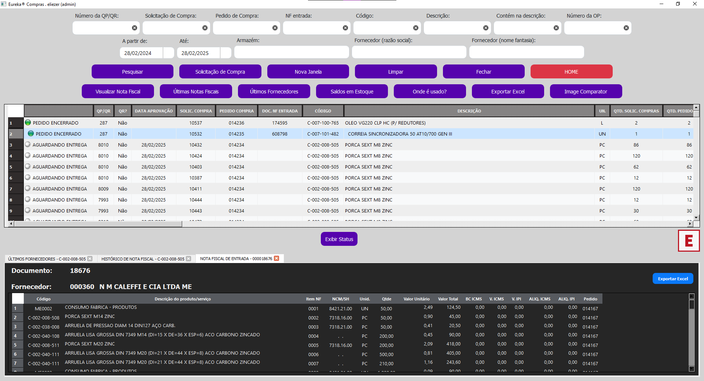

# 🎉 Sistema Eureka®
## 🚀 Introdução
O **Eureka®** é um sistema inovador desenvolvido para integrar quatro áreas cruciais da gestão industrial: Engenharia, PCP (Planejamento e Controle da Produção), Compras e Comercial. O objetivo do sistema é centralizar informações e automatizar processos, promovendo uma colaboração mais eficiente entre setores e decisões estratégicas mais ágeis, baseadas em dados confiáveis.

## 🎯 Benefícios
- **🔄 Automação de Processos:** Centraliza informações de diferentes setores, promovendo maior colaboração.
- **💸 Redução no uso de licenças TOTVS:** Menor concorrência entre usuários do SmartClient.
- **📝 Substituição de Planilhas Excel:** Elimina os riscos associados a conflitos de revisão de arquivos em nuvem, garantindo maior integridade e confiabilidade dos dados.
- **⚡ Agilidade nas Consultas:** Interface melhorada para consultas mais rápidas e pontuais, substituindo o uso do ERP Protheus.

## 🛠️ Módulos do Sistema

### 1. Módulo Engenharia 🏗️

- **🔍 Consulta de Produtos:** Permite pesquisar produtos por código, descrição, tipo, unidade de medida, armazém, grupo, entre outros.
- **➕ Cadastro de Produto:** Permite criar novos produtos ou copiar dados de produtos existentes para agilizar o cadastro.
- **✏️ Alteração de Cadastro de Produto:** Realiza modificações em produtos já cadastrados.
- **🔗 Consulta de Estrutura de Produtos:** Permite visualizar e alterar as quantidades de itens de uma estrutura.
- **📦 Saldo em Estoque:** Informa o saldo atual de um produto, incluindo quantidade disponível, empenhada e prevista.
- **🏷️ Últimos Fornecedores:** Mostra os últimos fornecedores de um determinado item.
- **📜 Histórico de Compras:** Exibe as últimas notas fiscais de entrada de um item.

### 2. Módulo PCP 🏭

- **📋 Gestão de Ordens de Produção:** Facilita a consulta e o gerenciamento de Ordens de Produção (OPs), com funcionalidades futuras para impressão e fechamento das OPs.
- **💻 Desenvolvimento em PyQt5.**

### 3. Módulo Compras 🛒

- **🔄 Acompanhamento de SCs e PCs:** Facilita o acompanhamento de Solicitações de Compra (SCs) e Pedidos de Compra (PCs).
- **📝 Follow-up e Consultas:** Acesso a notas fiscais e histórico de compras.
- **🔍 Filtros de Pesquisa:** Possibilidade de criar filtros nas tabelas para refinar as pesquisas.

### 4. Módulo Comercial 📊

- **💲 Cálculo de Custos:** Auxilia os profissionais da área comercial no cálculo e análise de custos de matérias-primas e itens comerciais.
- **📑 Relatórios de Custo:** Gera relatórios detalhados de custos, com exportação para Excel e PDF.
- **📊 Análises Simultâneas:** Permite abrir várias janelas para comparar custos de diferentes produtos.

### 5. Módulo Vendas 💼

### 6. Recursos Adicionais ⚙️

## 📞 Suporte
Caso encontre **bugs** ou tenha **dúvidas**, entre em contato com a equipe de suporte. Estamos disponíveis para esclarecimentos e contamos com sua colaboração para reportar eventuais problemas.

Para sugestões e melhoria, envie um [e-mail](mailto:eliezer.moraes@outlook.com.br).

---
