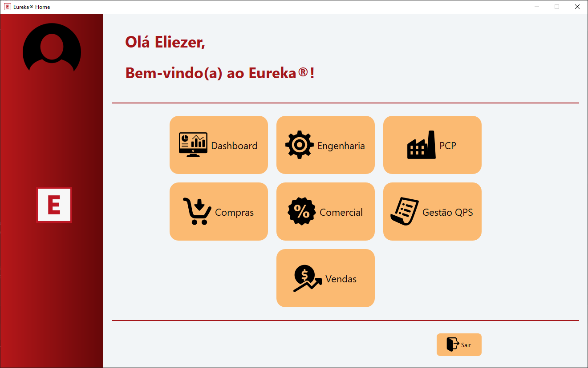
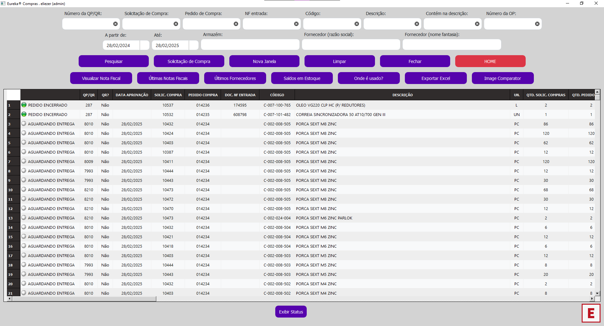
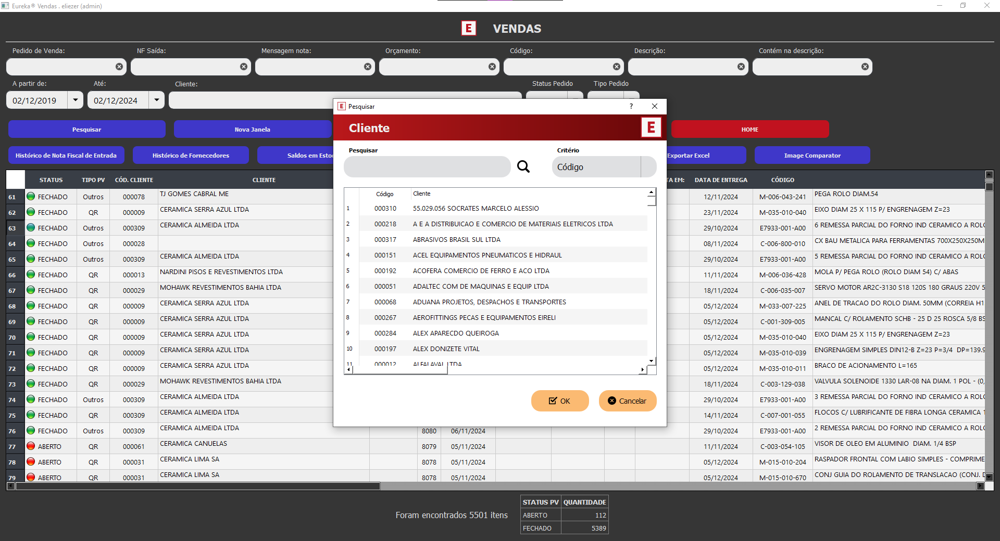

# EUREKA!® Sistema integrado de gestão industrial

<p align="center">

</p>

## 📑 Índice 

* [Introdução](#-introdução)
* [Benefícios](#-benefícios)
* [Módulos do Sistema](#️-módulos-do-sistema)
  * [Módulo Engenharia](#1-módulo-engenharia-️)
  * [Módulo PCP](#2-módulo-pcp-)
  * [Módulo Compras](#3-módulo-compras-)
  * [Módulo Comercial](#4-módulo-comercial-)
  * [Módulo Vendas](#5-módulo-vendas-)
* [Recursos Adicionais](#6-recursos-adicionais-️)
  * [Autocomplete e Histórico de Pesquisa](#61-autocomplete-e-histórico-de-pesquisa-)
  * [Estrutura Explodida de Produtos](#62-estrutura-explodida-de-produtos-)
* [Tecnologias Utilizadas](#-tecnologias-utilizadas)
* [Acesso ao Projeto](#-acesso-ao-projeto)
* [Suporte](#-suporte)
* [Autores](#-autores)
* [Licença](#-licença)

## 🚀 Introdução
O **Eureka!®** é uma aplicação desktop com o objetivo de 
proporcionar ao usuário uma experiência de usabilidade fácil, dinâmica e limpa.
Seu design foi pensado para ser agradável e fácil de usar.
Ele centraliza e integra dados de diferentes departamentos, Engenharia, PCP, Compras, Comercial e Vendas, proporcionando uma visão 
integrada, limpa e centralizada. 
Sua fonte de dados é a base de dados SQL Server do ERP Protheus TOTVS, garantindo 
confiabilidade e precisão nas informações, além de automatizar processos manuais, reduzindo 
erros e aumentando a produtividade. 
Com uma interface moderna e intuitiva, o Eureka supera a experiência do SmartClient 
TOTVS, agilizando consultas e cadastros ao uso usuário reduzindo tempo aumentando a produtividade. 
Sua flexibilidade permite exportação de relatórios nos formatos Excel e PDF.
Além disso, a solução reduz a concorrência por licenças TOTVS, gerando economia sem 
comprometer a produtividade. Complementar ao TOTVS, hoje tem sido uma ferramenta 
indispensável na empresa, pois economiza muito tempo de análise, consulta, cadastros, geração de relatórios e 
informações que antes demandavam muito tempo para serem obtidas e consolidadas.




## 🎯 Benefícios
- **👁️ Visão Integrada:** Centraliza informações críticas de diferentes departamentos, promovendo colaboração e eficiência na tomada de decisões.
- **⚡ Agilidade e Produtividade:** Automatiza processos manuais, liberando tempo para atividades estratégicas e reduzindo erros.
- **📊 Confiabilidade dos Dados:** Obtém dados diretamente do ERP Protheus, garantindo informações precisas e atualizadas.
- **🔄 Flexibilidade:** Permite exportação de relatórios em diferentes formatos e oferece opções de personalização por usuário/departamento.
- **💡 Suporte à Decisão:** Fornece informações estratégicas e análises detalhadas para apoiar decisões em todas as áreas.
- **🖥️ Interface Intuitiva:** Design moderno e amigável que supera a experiência do SmartClient TOTVS, facilitando o uso diário.
- **💰 Economia em Licenças:** Reduz a concorrência por licenças TOTVS ao oferecer uma interface mais eficiente para consultas e operações rotineiras.
- **🔗 Complementar ao TOTVS:** Potencializa a produtividade mantendo integração total com o Protheus, que permanece como núcleo essencial para gestão.

## 🛠️ Módulos do Sistema

### 1. Módulo Engenharia 🏗️


- **🔍 Consulta de Produtos:** Permite pesquisar produtos por código, descrição, tipo, unidade de medida, armazém, grupo, entre outros.
- **➕ Cadastro de Produto:** Permite criar novos produtos ou copiar dados de produtos existentes para agilizar o cadastro.
- **✏️ Alteração de Cadastro de Produto:** Realiza modificações em produtos já cadastrados.
- **🔗 Consulta de Estrutura de Produtos:** Permite visualizar e alterar as quantidades de itens de uma estrutura.
- **📦 Saldo em Estoque:** Informa o saldo atual de um produto, incluindo quantidade disponível, empenhada e prevista.
- **🏷️ Últimos Fornecedores:** Mostra os últimos fornecedores de um determinado item.
- **📜 Histórico de Compras:** Exibe as últimas notas fiscais de entrada de um item.

### 2. Módulo PCP 🏭


- **📋 Gestão de Ordens de Produção:** Facilita a consulta e o gerenciamento de Ordens de Produção (OPs), com funcionalidades futuras para impressão e fechamento das OPs.
- **💻 Desenvolvimento em PyQt5.**

### 3. Módulo Compras 🛒





- **🔄 Acompanhamento de SCs e PCs:** Facilita o acompanhamento de Solicitações de Compra (SCs) e Pedidos de Compra (PCs).
- **📝 Follow-up e Consultas:** Acesso a notas fiscais e histórico de compras.
- **🔍 Filtros de Pesquisa:** Possibilidade de criar filtros nas tabelas para refinar as pesquisas.

### 4. Módulo Comercial 📊


- **💲 Cálculo de Custos:** Auxilia os profissionais da área comercial no cálculo e análise de custos de matérias-primas e itens comerciais.
- **📑 Relatórios de Custo:** Gera relatórios detalhados de custos, com exportação para Excel e PDF.
- **📊 Análises Simultâneas:** Permite abrir várias janelas para comparar custos de diferentes produtos.

### 5. Módulo Vendas 💼





### 6. Recursos Adicionais ⚙️
### 6.1. Autocomplete e Histórico de Pesquisa 🔍


O recurso de autocompletar e histórico de pesquisa foi implementado utilizando um banco de dados SQLite local, armazenado no diretório AppData do Windows. Este recurso traz diversos benefícios:

- **🚀 Agilidade nas Consultas:** Reduz significativamente o tempo gasto em pesquisas ao sugerir termos já utilizados anteriormente
- **📝 Histórico Personalizado:** Mantém um registro das pesquisas mais frequentes de cada usuário
- **🔄 Persistência de Dados:** As sugestões são mantidas mesmo após fechar e reabrir o sistema
- **💡 Sugestões Inteligentes:** Apresenta sugestões baseadas no histórico de uso, priorizando as pesquisas mais recentes
- **⚡ Produtividade:** Minimiza erros de digitação e acelera o processo de busca de informações
- **🎯 Precisão:** Ajuda a encontrar termos exatos já utilizados anteriormente

### 6.2. Estrutura Explodida de Produtos 🌳


A funcionalidade de explosão hierárquica de estruturas permite visualizar todos os componentes de um produto de forma recursiva, oferecendo:

- **🔍 Busca Avançada:**
  - Pesquisa por código do item
  - Pesquisa por descrição (da esquerda para direita)
  - Pesquisa por termos contidos na descrição

- **🔗 Exploração Dinâmica:**
  - Visualização hierárquica de itens filhos na árvore de estrutura
  - Localização de itens específicos dentro da estrutura
  - Destaque e navegação automática após pesquisa

- **📄 Recursos Adicionais:**
  - Cópia de dados da tabela e árvore hierárquica
  - Acesso rápido aos desenhos via menu de contexto
  - Exportação completa para Excel
  - Alternância entre temas claro e escuro

- **✨ Benefícios:**
  - Pesquisa eficiente em estruturas complexas
  - Decisões mais assertivas com integração de desenhos PDF
  - Visualização completa da hierarquia do produto
  - Centralização de funcionalidades importantes
  - Personalização visual para maior conforto

## 📞 Suporte
Caso encontre **bugs** ou tenha **dúvidas**, entre em contato com a equipe de suporte. Estamos disponíveis para esclarecimentos e contamos com sua colaboração para reportar eventuais problemas.

Para sugestões e/ou melhorias, envie um e-mail clicando aqui: [e-mail](mailto:eliezer.moraes@outlook.com.br).

---

## 💻 Tecnologias Utilizadas
```
- Python 3.x
- PyQt5
- SQLite
- TOTVS Protheus (Integração)
- Git/GitHub
```

## 📁 Acesso ao Projeto

Para ter acesso ao projeto, siga os passos abaixo:

1. Clone o repositório:
```bash
git clone https://github.com/eliezer-moraes/eureka.git
```

2. Acesse a pasta do projeto:
```bash
cd eureka
```

3. Instale as dependências:
```bash
pip install -r requirements.txt
```

4. Execute o sistema:
```bash
python main.py
```

## 👥 Autores

| [<br><sub>Eliezer Moraes</sub>](https://github.com/eliezermoraesss) |
| :---: |

## 📝 Licença

Este projeto está sob a licença [MIT](LICENSE).

---

<p align="center">Desenvolvido com 💙 por <a href="https://www.linkedin.com/in/eliezer-moraes-silva-80b68010b/">Eliezer Moraes Silva</a></p>
